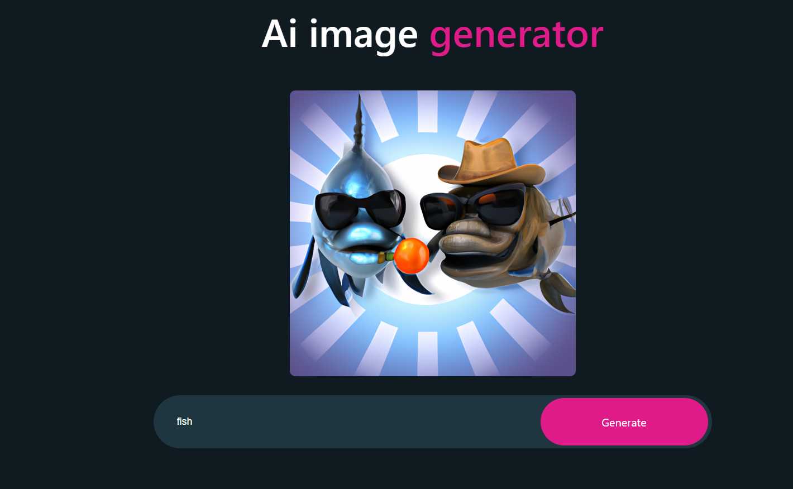

# AI Image Generator

## Overview

AI Image Generator is a React-based web application that allows users to generate images through OpenAI's API. Users can input a text description, and the application generates an image based on that description.

## Features

Text-based image generation using OpenAI's API
Responsive design
Loading state for better UX
Secure handling of API keys using environment variables

## Prerequisites

Node.js
npm
OpenAI API key

## Getting Started

Clone the Repository

### `git clone` [https://github.com/your-username/ai-image-generator.git]

### `cd ai-image-generator`

## Install Dependencies

### `npm install`

### Add OpenAI API Key

Create a `.env` file in the root directory and add your OpenAI API key like this:

`REACT_APP_OPENAI_API_KEY=your-openai-api-key-here`

## Start Development Server

### `npm start`

The application should now be running on [http://localhost:3000/.]

## Usage

Open the application in a web browser.
Input a text description in the search box.
Click "Generate" to produce an image based on your text description.

## Contributing

Pull requests are welcome. For major changes, please open an issue first to discuss what you would like to change.

## License

MIT
